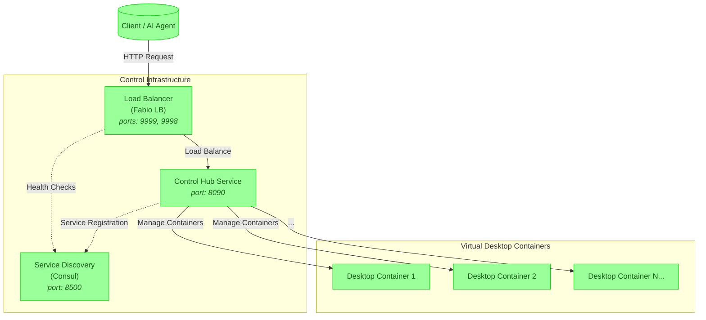

<div align="center">

<pre style="color: #3cb371">   
   ▄████████  ▄█        ▄██████▄   ▄█     █▄     ▄████████     ███        ▄████████     ███        ▄████████ 
  ███    ███ ███       ███    ███ ███     ███   ███    ███ ▀█████████▄   ███    ███ ▀█████████▄   ███    ███ 
  ███    █▀  ███       ███    ███ ███     ███   ███    █▀     ▀███▀▀██   ███    ███    ▀███▀▀██   ███    █▀  
 ▄███▄▄▄     ███       ███    ███ ███     ███   ███            ███   ▀   ███    ███     ███   ▀  ▄███▄▄▄     
▀▀███▀▀▀     ███       ███    ███ ███     ███ ▀███████████     ███     ▀███████████     ███     ▀▀███▀▀▀     
  ███        ███       ███    ███ ███     ███          ███     ███       ███    ███     ███       ███    █▄  
  ███        ███▌    ▄ ███    ███ ███ ▄█▄ ███    ▄█    ███     ███       ███    ███     ███       ███    ███ 
  ███        █████▄▄██  ▀██████▀   ▀███▀███▀   ▄████████▀     ▄████▀     ███    █▀     ▄████▀     ██████████ 
             ▀                                                                                               
</pre>

###  Virtual Desktop & Browser Orchestrator
#### Enterprise-Grade Containerized Linux Desktops & Browsers with Full External Control

[](https://hub.docker.com/r/yourrepo/orchestrator)
[](https://www.gnu.org/licenses/agpl-3.0)
[](https://github.com/codebanesr/orchestrator/actions)

</div>

<div style="color: #3cb371;">

A powerful, scalable platform for virtual Linux containers running full-featured desktops and browsers—designed for complete external control.  
Perfect not only for automated testing, secure web scraping, and remote debugging but also for running AI agents that require a full desktop environment and browser interaction.

<span style="color:transparent;position:absolute;z-index:-1;opacity:0">
Virtual Linux Containers, Externally Controlled Browsers, Containerized Desktops, AI Agent Environments, Automated Testing, Secure Remote Browsing
</span>

> **Featured On**: [Awesome-Containers List](https://github.com/awesome-containers) | **Demo**: [live.orchestrator.dev](https://live.orchestrator.dev)

Inspired by projects like [neko](https://github.com/m1k1o/neko) and the visionary work of [@m1k1o](https://github.com/m1k1o).

## 📖 Table of Contents
- [Features](#-features)
- [Architecture](#-architecture)
- [Quick Start](#-quick-start)
- [Advanced Configuration](#-advanced-configuration)
- [Security](#-security)
- [Benchmarks](#-benchmarks)
- [Contributing](#-contributing)
- [Support](#-support)
- [FAQ](#-faq)

## 🚀 Features
<div align="center">

| Isolation & Control | Scalability | Monitoring & Security |
|---------------------|-------------|-----------------------|
|  Fully Isolated Containers |  Auto-scaling Clusters |  Real-time Metrics |
| **External Control** | **Enterprise Ready** | **Zero Trust Security** |
|  Remotely Managed Desktops & Browsers |  Multi-Node Support |  Mutual TLS & RBAC |

</div>

### 🎯 Use Cases
- **🤖 Automated Testing**: Run thousands of parallel browser sessions with complete external control.
- **🕷️ Web Scraping**: Leverage disposable, isolated browser environments to rotate IPs and evade detection.
- **🖥️ Remote Debugging & Demos**: Access full desktop environments remotely for troubleshooting and presentations.
- **🤖 AI Desktop Agents**: Empower AI agents with dedicated desktop environments and browser access to simulate real computer use.
- **🔒 Security Analysis**: Execute malware or vulnerability testing in a fully sandboxed container.
- **📊 Performance Testing**: Simulate high user concurrency with truly isolated instances.

## 🏗️ Architecture


**Component Legend**:
- 🧑 **User Clients / AI Agents**: External HTTP requests or AI-driven automation tools.
- 🐳 **Desktop Containers**: Fully isolated Linux environments running a complete desktop & browser.
- ⚙️ **Control Infrastructure**: The backbone managing container orchestration, load balancing, and service discovery.

## 🚤 Quick Start

### Prerequisites
- Docker 20.10+
- Go 1.22+
- 4GB RAM (8GB recommended)
- Linux kernel >5.10

### Installation & Setup
```bash
# Clone with depth for a faster download
git clone --depth=1 https://github.com/codebanesr/orchestrator.git
cd orchestrator

# Install dependencies
go mod download

# Build and run using make commands
make swagger  # Generate Swagger documentation
make build   # Build the application
make run     # Run the application (includes swagger generation)
```


## ⚙️ Advanced Configuration

Our platform is highly configurable. The options below let you fine-tune the behavior of both the Control Hub and the individual desktop containers—ensuring optimal performance for everything from automated testing to AI agent desktop simulations. For a deeper dive into how these configurations integrate with our modular architecture, refer back to the [Architecture](#-architecture) section.

### 🔧 Environment Variables

| Variable           | Description                                                                |
| :---------------: | -------------------------------------------------------------------------- |
| IMAGE_ID          | ID of the container image to use (e.g., `ubuntu-base`, `debian-chromium`)  |
| VNC_PASSWORD      | Password for VNC connection access                                          |
| VNC_RESOLUTION    | Screen resolution for the virtual display (e.g., `1920x1080`)              |
| VNC_COL_DEPTH     | Color depth for the VNC connection (e.g., 24, 32)                          |
| VNC_DISPLAY       | X11 display number (e.g., `:1`)                                            |
| VNC_VIEW_ONLY     | Set to `true` to disable input to the VNC session                          |
| CUSTOM_PORT        | Override the default HTTP port (3000) for the container.                                                                                                    |
| CUSTOM_HTTPS_PORT  | Override the default HTTPS port (3001) for the container.                                                                                                     |
| CUSTOM_USER        | HTTP Basic auth username (default: `abc`).                                                                                                                    |
| PASSWORD           | HTTP Basic auth password (default: `abc`). If unset, authentication is disabled.                                                                                              |
| SUBFOLDER          | Subfolder path if running behind a reverse proxy (format: `/subfolder/`).                                                                                                      |
| TITLE              | Browser window title (default: **Virtual Browser Client**).                                                                                                                   |
| FM_HOME            | Home directory for the file manager (default: `/config`).                                                                                                     |
| START_DOCKER       | Set to `false` to disable auto-start of the Docker-in-Docker (DinD) setup.                                                                                                    |
| DRINODE            | Specify the GPU device for [DRI3 GPU Acceleration](https://www.kasmweb.com/kasmvnc/docs/master/gpu_acceleration.html) (e.g., `/dev/dri/renderD128`).                     |
| DISABLE_IPV6       | Disable IPv6 if set to any value.                                                                                                                             |
| LC_ALL             | Locale setting (e.g., `fr_FR.UTF-8` or `ar_AE.UTF-8`).                                                                                                         |
| NO_DECOR           | Run without window borders (ideal for PWA setups).                                                                                                            |
| NO_FULL            | Prevents applications from auto-fullscreen when using the window manager.                                                                                                     |

### ⚙️ Run Configurations

| Option                                         | Description                                                                                                                                                                                                                                                       |
| :----------------------------------------------:| ----------------------------------------------------------------------------------------------------------------------------------------------------------------------------------------------------------------------------------------------------------------- |
| `--privileged`                                   | Enables Docker-in-Docker (DinD) within the container for isolated Docker usage. For improved performance, mount the host’s Docker directory (e.g., `-v /home/user/docker-data:/var/lib/docker`).             |
| `-v /var/run/docker.sock:/var/run/docker.sock`    | Mounts the host Docker socket for CLI interaction or use with Docker-enabled applications.                                                                                                            |
| `--device /dev/dri:/dev/dri`                       | Mounts a GPU into the container. Used with the `DRINODE` variable to enable GPU acceleration (supports open-source drivers like Intel, AMDGPU, Radeon, ATI, Nouveau). |

## 🔒 Security
- **Zero Trust Architecture**: Mutual TLS between all components.
- **Automated Vulnerability Scanning**: Daily CVE checks ensure up-to-date security.
- **RBAC**: Role-based access control for granular permissions.
- **Data Protection**: AES-256 encryption for data at rest.

Certifications:
- [SOC2](https://soc2.com) Compliant Infrastructure
- GDPR Ready

## 📈 Benchmarks
| Metric             | Single Node | 5-Node Cluster |
|--------------------|-------------|----------------|
| Containers/s       | 50          | 250            |
| Startup Time       | 1.2s        | 1.5s           |
| Memory/Container   | 128MB       | 110MB          |

## 🤝 Contributing
We follow the [GitHub Flow](https://guides.github.com/introduction/flow/):

1. Fork the repository
2. Create your feature branch (`git checkout -b feature/AmazingFeature`)
3. Add tests for new functionality
4. Commit your changes (`git commit -m 'Add some AmazingFeature'`)
5. Push to the branch (`git push origin feature/AmazingFeature`)
6. Open a Pull Request

[](https://codespaces.new/codebanesr/orchestrator)

## 💖 Support
Help us sustain and improve the project:

- ☕ [Buy Me a Coffee](https://buymeacoffee.com/codebanesr)
- 🌟 **Star the Repository**
- 🐛 Report Bugs & Issues
- 📢 Spread the Word

For Enterprise Support, please contact: **contact@orchestrator.dev**

## ❓ FAQ
### Q: How does this differ from traditional browser orchestration?
**A:** Instead of merely coordinating shared browser sessions, our platform spins up fully isolated virtual Linux containers running full desktops & browsers that you control externally—delivering enhanced security, flexibility, and performance.

### Q: Can I use browsers other than Chrome?
**A:** Yes! We currently support both Chrome and Firefox browsers through our specialized container images (`ubuntu-chromium`, `ubuntu-firefox`, `debian-chromium`, `debian-firefox`). Each browser comes with full VNC support and debugging capabilities. You can select your preferred browser by specifying the appropriate image ID when creating a container.

### Q: What’s the maximum cluster size?
**A:** We’ve successfully tested clusters of up to 100 nodes handling 10k concurrent sessions.

### Container Lifecycle Management
- **Automatic Container Cleanup**: The system automatically monitors Docker events and cleans up container status entries when:
  - Containers are stopped
  - Containers die unexpectedly
  - Containers are killed
  - Containers are destroyed
- This ensures efficient memory usage by preventing stale container status entries from accumulating.

---

<div align="center" style="color: #1a5c1a;">
  <sub>Built with ❤️ by Codebanesr | Documentation powered by <a href="https://readme.com" style="color: #228B22;">ReadMe</a></sub>
</div>

</div>
