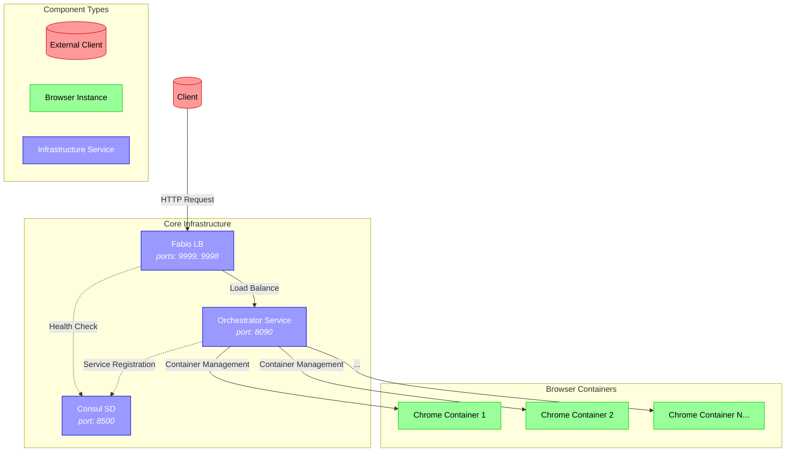

# Browser Orchestration Service

A powerful, scalable container orchestration service that provides on-demand isolated Chrome browser instances. Built with Docker, Consul, and Fabio, it offers enterprise-grade browser automation and streaming capabilities.



## Why Choose This Service?

### Versatile Use Cases

- **Automated Testing**: Perfect for Playwright/Selenium testing at scale
- **Video Streaming**: Isolated instances for streaming services and content delivery
- **Web Scraping**: Distributed web scraping with automatic IP rotation
- **Anonymous Browsing**: Disposable browser instances for privacy-focused operations
- **Browser Automation**: Ideal for RPA (Robotic Process Automation) workflows
- **Load Testing**: Simulate real user browser behavior at scale

### Competitive Advantages

- **True Isolation**: Each browser runs in its own container, ensuring complete isolation
- **Auto-Scaling**: Dynamically scale browser instances based on demand
- **High Availability**: Built-in failover and health monitoring
- **Cost-Effective**: Pay only for active instances
- **Enterprise Ready**: Secure, monitored, and production-grade

## Architecture

### Core Components

- **Orchestrator Service**: Go-based core service managing container lifecycle
- **Consul**: Service discovery and health monitoring
- **Fabio**: Dynamic routing and load balancing
- **Chrome Containers**: Isolated browser instances

### Why This Architecture?

- **Scalability**: Horizontal scaling with zero downtime
- **Reliability**: Automatic failover and self-healing
- **Security**: Network isolation and containerized environments
- **Performance**: Optimized resource utilization
- **Maintainability**: Microservices architecture for easy updates

## Quick Start Guide

### Prerequisites

- Docker and Docker Compose
- Go 1.24 or higher

### 1. Clone and Deploy

```bash
# Clone the repository
git clone git@github.com:codebanesr/orchestrator.git
cd orchestrator

# Start all services
docker-compose up -d
```

View the complete [docker-compose.yaml](docker-compose.yaml) for detailed configuration.

### 2. Access Services

- **Consul UI**: http://localhost:8500
- **Fabio UI**: http://localhost:9998
- **Orchestrator API**: http://localhost:8090

### 3. Create Browser Instance

```bash
curl -X POST http://localhost:8090/containers
```

View the complete [API Documentation](docs/swagger.yaml) for all endpoints.

## Scaling Strategies

### Horizontal Scaling

- Automatic container distribution across nodes
- Load-based instance scaling
- Geographic distribution support

### Resource Optimization

- Intelligent resource allocation
- Automatic cleanup of inactive instances
- Configurable resource limits

### High Availability

- Multi-zone deployment support
- Automatic failover
- Health-based routing

## Security

- Container isolation ensures secure browser instances
- Basic authentication for API endpoints
- Network isolation through Docker networking
- Regular security updates

### Building from Source

```bash
go mod download
go build
```

## Contributing

1. Fork the repository
2. Create a feature branch
3. Submit a pull request