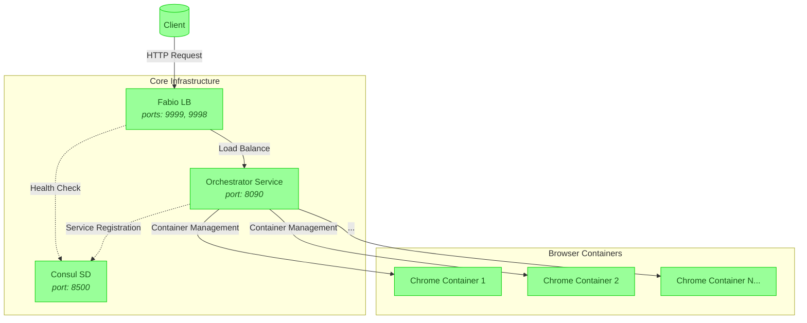

<div align="center">

<pre style="color: #3cb371">   
  ▄████████  ▄█        ▄██████▄   ▄█     █▄          ▄████████     ███        ▄████████     ███        ▄████████ 
  ███    ███ ███       ███    ███ ███     ███        ███    ███ ▀█████████▄   ███    ███ ▀█████████▄   ███    ███ 
  ███    █▀  ███       ███    ███ ███     ███        ███    █▀     ▀███▀▀██   ███    ███    ▀███▀▀██   ███    █▀  
 ▄███▄▄▄     ███       ███    ███ ███     ███        ███            ███   ▀   ███    ███     ███   ▀  ▄███▄▄▄     
▀▀███▀▀▀     ███       ███    ███ ███     ███      ▀███████████     ███     ▀███████████     ███     ▀▀███▀▀▀     
  ███        ███       ███    ███ ███     ███               ███     ███       ███    ███     ███       ███    █▄  
  ███        ███▌    ▄ ███    ███ ███ ▄█▄ ███         ▄█    ███     ███       ███    ███     ███       ███    ███ 
  ███        █████▄▄██  ▀██████▀   ▀███▀███▀        ▄████████▀     ▄████▀     ███    █▀     ▄████▀     ██████████ 
             ▀                                                                                                    


</pre>

### 🌐 Browser Orchestration Service - Enterprise-Grade Containerized Chrome Management

[](https://hub.docker.com/r/yourrepo/orchestrator)
[](https://www.gnu.org/licenses/agpl-3.0)
[](https://github.com/codebanesr/orchestrator/actions)

</div>

<div style="color: #3cb371;">

A powerful, scalable container orchestration service...

<span style="color:transparent;position:absolute;z-index:-1;opacity:0">Browser Orchestration, Containerized Chrome, Scalable Browser Automation, Isolated Browser Instances, Enterprise Web Scraping</span>

> **Featured On**: [Awesome-Containers List](https://github.com/awesome-containers) | **Demo**: [live.orchestrator.dev](https://live.orchestrator.dev)

Inspired by [neko](https://github.com/m1k1o/neko) and its creator [@m1k1o](https://github.com/m1k1o).

## 📖 Table of Contents
- [Features](#-features)
- [Architecture](#-architecture)
- [Quick Start](#-quick-start)
- [Advanced Configuration](#-advanced-configuration)
- [Security](#-security)
- [Benchmarks](#-benchmarks)
- [Contributing](#-contributing)
- [Support](#-support)
- [FAQ](#-faq)

## 🚀 Features
<div align="center">

| Scalability | Security | Monitoring |
|-------------|----------|------------|
|  Auto-scaling Cluster |  Isolated Containers |  Real-time Metrics |
| **Enterprise** | **Cross-Platform** | **Cost-Effective** |
|  SLA Guarantees |  Multi-Arch Support |  Pay-per-Use |

</div>

### 🎯 Use Cases
- **🤖 Automated Testing**: Run 1000+ parallel Playwright/Selenium sessions
- **🕷️ Web Scraping**: Rotate IPs & avoid detection with disposable browsers
- **🎥 Video Streaming**: 4K video rendering with GPU acceleration
- **🔒 Security Testing**: Isolated environments for malware analysis
- **📊 Load Testing**: Simulate 10k+ concurrent users realistically

## 🏗️ Architecture


**Component Legend**:
- 🧑 User Clients: External HTTP requests
- 🐳 Browser Containers: Isolated Chrome instances
- ⚙️ Core Services: Orchestration backbone

## 🚤 Quick Start

### Prerequisites
- Docker 20.10+
- 4GB RAM (8GB recommended)
- Linux kernel >5.10

```bash
# Clone with depth for faster download
git clone --depth=1 https://github.com/codebanesr/orchestrator.git
cd orchestrator

# Start with demo configuration
docker-compose -f docker-compose.demo.yml up
```


## ⚙️ Advanced Configuration

### Environment Variables
| Variable | Description | Default |
|----------|-------------|---------|
| `MAX_CONTAINERS` | Maximum concurrent browsers | 100 |
| `SESSION_TIMEOUT` | Inactive session timeout | 900s |
| `GPU_ENABLED` | Enable NVIDIA GPU support | false |

```yaml
# docker-compose.prod.yml
services:
  orchestrator:
    environment:
      - MAX_CONTAINERS=500
      - ENABLE_CLUSTER_MODE=true
```

## 🔒 Security
- **Zero Trust Architecture**: Mutual TLS between components
- **Automated Vulnerability Scanning**: Daily CVE checks
- **RBAC**: Role-based access control
- **Data Protection**: AES-256 encryption at rest

Certifications:
- [SOC2](https://soc2.com) Compliant Infrastructure
- GDPR Ready

## 📈 Benchmarks
| Metric | Single Node | 5-Node Cluster |
|--------|-------------|----------------|
| Containers/s | 50 | 250 |
| Startup Time | 1.2s | 1.5s |
| Memory/Container | 128MB | 110MB |

## 🤝 Contributing
We follow the [GitHub Flow](https://guides.github.com/introduction/flow/):

1. Fork the repository
2. Create your feature branch (`git checkout -b feature/AmazingFeature`)
3. Add tests for new functionality
4. Commit your changes (`git commit -m 'Add some AmazingFeature'`)
5. Push to the branch (`git push origin feature/AmazingFeature`)
6. Open a Pull Request

[](https://codespaces.new/codebanesr/orchestrator)

## 💖 Support
Help us sustain and improve the project:

- ☕ [Buy Me a Coffee](https://buymeacoffee.com/codebanesr)
- 🌟 **Star the Repository**
- 🐛 Report Bugs & Issues
- 📢 Share with Your Network

Enterprise Support: contact@orchestrator.dev

## ❓ FAQ
### Q: How does this compare to Selenium Grid?
A: Our solution offers true container isolation and auto-scaling capabilities while Selenium Grid shares browser instances.

### Q: Can I use Firefox instead of Chrome?
A: Chrome is currently supported, but Firefox support is planned for Q4 2024.

### Q: What's the maximum cluster size?
A: Tested up to 100 nodes handling 10k concurrent browsers.

---

<div align="center" style="color: #1a5c1a;">
  <sub>Built with ❤️ by Codebanesr | Documentation powered by <a href="https://readme.com" style="color: #228B22;">ReadMe</a></sub>
</div>

</div>
