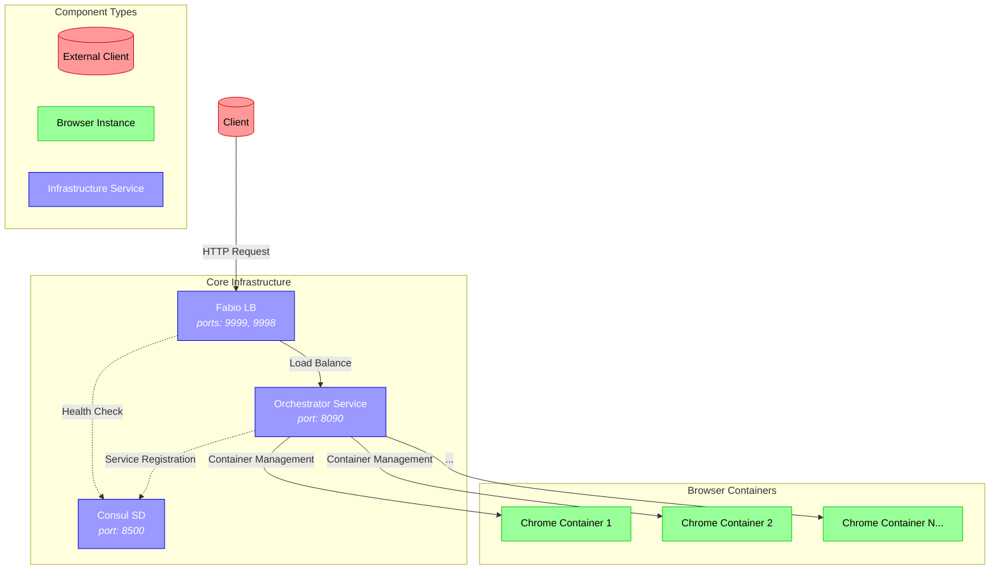

<div align="center">

<pre>
   ▄███████▄  ▄██████▄     ▄████████     ███        ▄████████  ▄█       
  ███    ███ ███    ███   ███    ███ ▀█████████▄   ███    ███ ███       
  ███    ███ ███    ███   ███    ███    ▀███▀▀██   ███    ███ ███       
  ███    ███ ███    ███  ▄███▄▄▄▄██▀     ███   ▀   ███    ███ ███       
▀█████████▀  ███    ███ ▀▀███▀▀▀▀▀       ███     ▀███████████ ███       
  ███        ███    ███ ▀███████████     ███       ███    ███ ███       
  ███        ███    ███   ███    ███     ███       ███    ███ ███▌    ▄ 
 ▄████▀       ▀██████▀    ███    ███    ▄████▀     ███    █▀  █████▄▄██ 
                          ███    ███                          ▀         
</pre>

### 🌐 Browser Orchestration Service

</div>

A powerful, scalable container orchestration service that provides on-demand isolated Chrome browser instances. Built with Docker, Consul, and Fabio, it offers enterprise-grade browser automation and streaming capabilities.

Inspired by [neko](https://github.com/m1k1o/neko) and its creator [@m1k1o](https://github.com/m1k1o).

## 📖 Table of Contents
- [Features](#-features)
- [Architecture](#-architecture)
- [Installation](#-installation)
- [Usage](#-usage)
- [Security](#-security)
- [Contributing](#-contributing)
- [Support](#-support)

## 🚀 Features
✅ True Container Isolation  
✅ Auto-Scaling Capabilities  
✅ High Availability Design  
✅ Enterprise-Grade Security  
✅ Cost-Effective Solutions  

### 🎯 Use Cases
- **🤖 Automated Testing**: Perfect for Playwright/Selenium testing at scale
- **🎥 Video Streaming**: Isolated instances for streaming services
- **🕷️ Web Scraping**: Distributed scraping with IP rotation
- **🔒 Anonymous Browsing**: Disposable browser instances
- **⚡ Browser Automation**: Ideal for RPA workflows
- **📊 Load Testing**: Simulate real user behavior

## 🏗️ Architecture


### Core Components
- **🎮 Orchestrator Service**: Go-based core service
- **🔍 Consul**: Service discovery and monitoring
- **⚖️ Fabio**: Dynamic routing and load balancing
- **🌐 Chrome Containers**: Isolated browser instances

## 🔧 Installation

### Prerequisites
- Docker and Docker Compose
- Go 1.24 or higher

```bash
# Clone the repository
git clone git@github.com:codebanesr/orchestrator.git
cd orchestrator

# Start all services
docker-compose up -d
```

## 🎮 Usage

### Access Points
- **Consul UI**: http://localhost:8500
- **Fabio UI**: http://localhost:9998
- **Orchestrator API**: http://localhost:8090

### Quick Start
```bash
curl -X POST http://localhost:8090/orchestrator/containers
```

## 🔒 Security
- Container isolation ensures secure browser instances
- Basic authentication for API endpoints
- Network isolation through Docker networking
- Regular security updates

## 🤝 Contributing
1. Fork the repository
2. Create a feature branch
3. Submit a pull request

## 💖 Support
If you find this project helpful, consider supporting its development:

BTC Address: `bc1qe5zzuav86unsle7a3mtsxmgxhuqx3v05twz7fm`